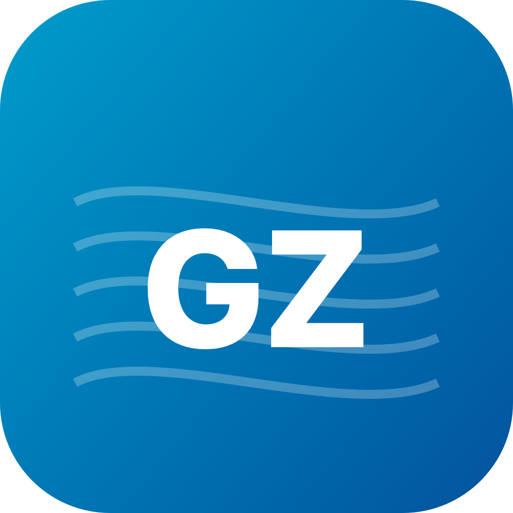
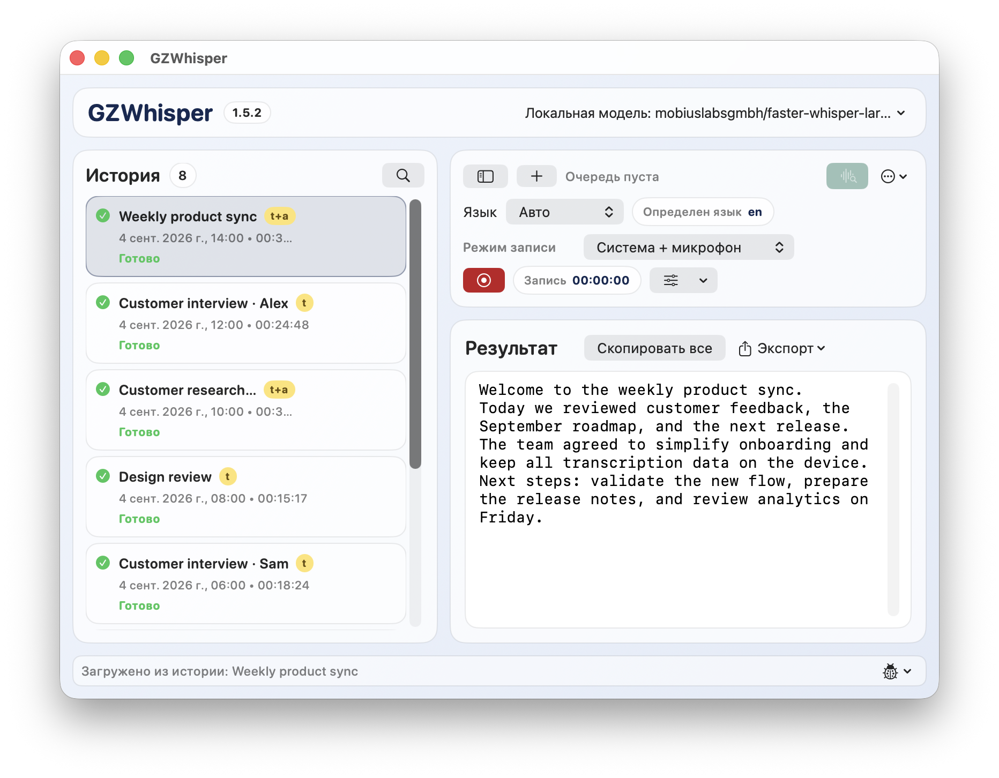
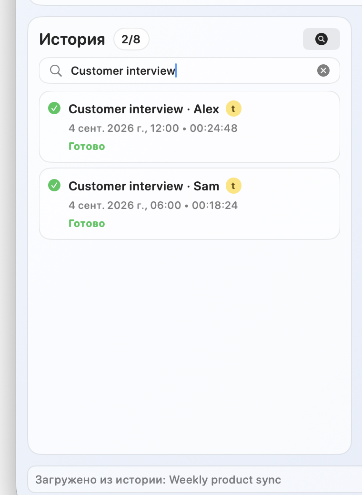

<p align="center">
  
</p>

<h1 align="center">GZWhisper</h1>

<p align="center">
  Private, local-first transcription for macOS.
</p>

<p align="center">
  
  
  
  
</p>

<p align="center">
  <a href="https://github.com/globa-me/GZWhisper/releases/latest/download/GZWhisper-Installer-1.5.2.dmg"><strong>Download DMG</strong></a>
  ·
  <a href="https://github.com/globa-me/GZWhisper/releases/latest/download/GZWhisper-macOS-1.5.2.zip"><strong>Download ZIP</strong></a>
  ·
  <a href="docs/GZWHISPER_PRODUCT_FUNCTIONALITY_RU.md">Описание на русском</a>
</p>

<table>
  <tr>
    <td width="72%">
      
    </td>
    <td width="28%">
      
    </td>
  </tr>
</table>

## Highlights

- Local transcription with Whisper-compatible models from Hugging Face.
- Audio, video, microphone, system audio, or system audio + microphone.
- Pause/resume recording and automatic recovery after interrupted sessions.
- Searchable history, transcription queue, rename, delete with undo, and quick actions.
- TXT and JSON export, including multi-select ZIP archives with one file per transcript.
- Russian, English, and Chinese interface.

Your media, recordings, models, and transcripts stay on your Mac. Network access is only needed to download a model.

## Install on macOS

Current release: **v1.5.2 · build 270826**.

Requirements: Apple Silicon Mac, macOS 12 or later. System-audio recording requires macOS 13 or later.

1. Download the [DMG](https://github.com/globa-me/GZWhisper/releases/latest/download/GZWhisper-Installer-1.5.2.dmg) or [ZIP](https://github.com/globa-me/GZWhisper/releases/latest/download/GZWhisper-macOS-1.5.2.zip).
2. Move `GZWhisper.app` to `/Applications`.
3. Open the app and allow microphone or system-audio access when needed.

<details>
<summary><strong>If macOS blocks the app</strong></summary>

Control-click `GZWhisper.app` and choose **Open**. If macOS still blocks it, open **System Settings → Privacy & Security → Open Anyway**. Do not disable Gatekeeper globally.

</details>

## Build from source

```bash
git clone https://github.com/globa-me/GZWhisper.git
cd GZWhisper
PYTHON_BIN="$(brew --prefix python@3.12)/bin/python3.12" ./scripts/prepare_embedded_python.sh
./scripts/build_app.sh
open build/GZWhisper.app
```

The macOS build uses the bundled Python runtime and offline wheelhouse. Release packages:

```bash
./scripts/package_zip.sh
./scripts/build_dmg.sh
```

## Platform status

| Platform | Status | Source / guide |
|---|---|---|
| macOS arm64 | Primary, tested | `Sources/` |
| Linux | Experimental | `linux/gzwhisper_linux.py` |
| Windows portable | Experimental | [Windows guide](docs/WINDOWS_PORTABLE.md) |

## Project map

- `Sources/` — SwiftUI macOS application.
- `Resources/transcription_worker.py` — shared transcription worker.
- `scripts/` — build, packaging, and safety tools.
- [`docs/GZWHISPER_PRODUCT_FUNCTIONALITY_RU.md`](docs/GZWHISPER_PRODUCT_FUNCTIONALITY_RU.md) — full product functionality in Russian.

## Release checks

```bash
./scripts/check_repo_security.sh
./scripts/check_wheelhouse.sh
codesign --verify --deep --strict build/GZWhisper.app
```

Built and maintained by [Gennadiy Zakharov](https://zakharov.asia/).
